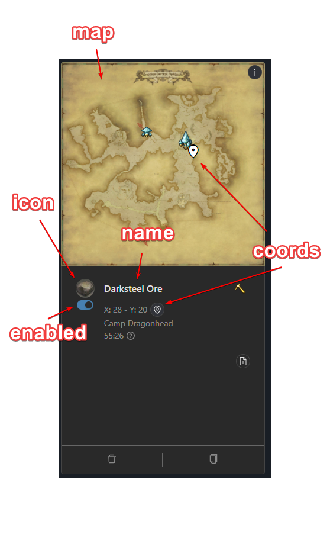

# Cloud Firestore

<!-- .slide: class="page-title" -->

Notes :


## Summary

<!-- .slide: id = "master-toc" class="toc" -->

- [Presentation](#/1)
- [Getting Started](#/2)
- [Authentication](#/3)
- **[Cloud Firestore](#/4)**
- [Realtime Database](#/5)
- [Hosting](#/6)
- [Storage](#/7)
- [Messaging](#/8)
- [To go further](#/9)

Notes :


## Reminder: NoSQL document-oriented databases

 - Collections containing documents.
 - Better at reading than writing.
 - Not designed for aggregation queries (count, filter, etc).
 - *Schemaless*.
 - Offline persistence.

<div style="display:flex">

</div>

Notes :


## Data modeling

<!-- .element class="fragment" -->
- *UI first*.

<!-- .element class="fragment" -->
- Do not worry about data replication (at least not too much).

<!-- .element class="fragment" -->
- Design your data the way you want to get it.

<!-- .element class="fragment" -->
- Use other solutions for search indexing

Notes :


## Data modeling


  

Notes :


## Usage - Create

```ts
this.angularFirestore
  .collection<User>('users')
  .add({name: 'James Holden', crew: 'Rocinante'});
```

Returns the unique identifier of the document that has been added.

Notes : Disclaimer: examples are using angularFire, but other languages and implementations are available on officiel docs website


## Usage - Read

```ts
// Get a specific document
const user$: Observable<User> = this.angularFirestore
  .doc<User>('users/00086tE6xfgyC1RCqJ2EaTncmXx1')
  .valueChanges();

// Get an entire collection
const users$: Observable<User[]> = this.angularFirestore
  .collection<User>('users')
  .valueChanges();

// Get an entire collection with a query
const usersNamedJamesHolden$: Observable<User[]> = this.angularFirestore
  .collection<User>('users', ref => ref.where('name', '==', 'James Holden'))
  .valueChanges();
```

Notes : Disclaimer: examples are using angularFire, but other languages and implementations are available on officiel docs website


## Usage - Update
```ts
// Partial update, non destructive
this.angularFirestore
  .collection<User>('users')
  .doc('00086tE6xfgyC1RCqJ2EaTncmXx1')
  .update({name: 'Fred Johnson'});

// Full overwrite
this.angularFirestore
  .collection<User>('users')
  .doc('00086tE6xfgyC1RCqJ2EaTncmXx1')
  .set({name: 'Fred Johnson', crew: 'APE'});
```

Some transactional operations are also possible, to increment a field value server-side.

Notes : Disclaimer: examples are using angularFire, but other languages and implementations are available on officiel docs website


## Usage - Delete

```ts
this.angularFirestore
  .collection<User>('users')
  .doc('00086tE6xfgyC1RCqJ2EaTncmXx1')
  .delete();
```

Notes : Disclaimer: examples are using angularFire, but other languages and implementations are available on officiel docs website


## Limits and optimizations

- 1 write operation per second per document.
- 1MB max document size.
- No `.` or `..` document ids.
- No `/` in document ids.
- Avoid using auto-increment composed properties (like `user1`, `user2`, `user3`, etc).
- No `.`,`]`,`[`,`*`,` in field names.
- Limit indexes to what you absolutely need, too many indexes can cause performance issues.
- https://cloud.google.com/firestore/docs/best-practices

Notes :


## Indexes

 - Helps with search operations.
 - Are created from the client library when it detects an index is needed.

Notes :


## Security

<!-- .slide: class="page-demo" -->

Notes : small tour of the rules system.


### The rules

  - Operation permissions:
    - read, write.
    - create, update, delete.
  - Functions.
  - Can get data from the database or the request.
  - Auth context inside the request.

Notes : Do not forget to explain that getting a document in a function costs an operation.


## Pricing

  - Free tier:
    - *20k* write operations per day.
    - *50k* read operations per day.
    - *20k* delete operations per day.
  - After that:
    - *$0.036* / 100k read operations.
    - *$0.108* / 100k write operations.
    - *$0.012* / 100k delete operations.

Notes :


## To go further

https://firebase.google.com/docs/firestore

Notes :


<!-- .slide: class="page-questions" -->


<!-- .slide: class="page-tp3" -->
