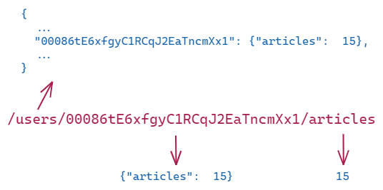

# Realtime Database

<!-- .slide: class="page-title" -->

Notes :

## Summary

<!-- .slide: id = "master-toc" class="toc" -->

- [Presentation](#/1)
- [Getting Started](#/2)
- [Authentication](#/3)
- [Cloud Firestore](#/4)
- **[Realtime Database](#/5)**
- [Hosting](#/6)
- [Storage](#/7)
- [Messaging](#/8)
- [To go further](#/9)

Notes :

## Presentation

 - Synchronized in realtime to every connected client.
 - key:value storage.
 - Can be seen as a giant realtime JSON file.
 - **Not** designed for queries, search and relational behavior.
 - Useful to store small data that's updated very often.

Notes : 

## Data structure

 - Design it like a JSON file.
 - Keep it small and meaningful.
 - Make it easy to access (REST-like).

Notes : Getting smaller data means less bandwidth usage

## Security

<!-- .slide: class="page-demo" -->

Notes : small tour of the rules system.

## Pricing

- Free tier:
  - *100* max simultaneous connections.
  - *1GB* data stored.
  - *10GB* data downloaded.
- After that:
  - *250k* max connections per database if using a paid plan.
  - *$5*/GB of data stored.
  - *$1*/GB downloaded.

Notes : Don't forget this applies after free tier, so everything is paid after free tier has been reached.

<!-- .slide: class="page-tp5" -->
